# JunoResBench release validation atlas

Overall state: **REJECTED**

Expert reconstruction gates are deferred; this report validates serialized physics and observables.
REVIEW means that the owner must inspect the figure before publication; no machine gate replaces that review.

| Figure | Check | Status |
|---|---|---|
| `vertex_distribution` | 顶点总体是否符合球体部署 | REVIEW |
| `energy_radius_coverage` | 能量与位置覆盖是否完整 | REVIEW |
| `radial_light_yield` | 光收集位置依赖是否可见 | REVIEW |
| `hit_pattern_comparison` | 中心/边缘 hit pattern 是否不同 | REVIEW |
| `charge_pattern_comparison` | 电荷空间梯度是否编码位置 | REVIEW |
| `hit_multiplicity_vs_energy` | 占用数是否随能量增长 | REVIEW |
| `charge_vs_energy` | 积分电荷是否保存能量信息 | PASS |
| `event_anatomy` | 单事件空间、时间和波形是否自洽 | REVIEW |
| `first_hit_time` | prompt 与晚光结构是否存在 | REVIEW |
| `time_vs_distance` | 首光是否随传播距离推迟 | PASS |
| `tof_corrected_residual` | TOF 校正后是否有 prompt core 和晚尾 | REVIEW |
| `timing_vs_radius` | trigger-relative timing 是否有位置依赖 | REVIEW |
| `waveform_examples` | 低/中/高电荷波形是否合理 | REVIEW |
| `waveform_overlays` | 脉冲成形模板是否稳定 | REVIEW |
| `pulse_integral_vs_peak` | 峰高与积分是否自洽 | REVIEW |
| `roi_structure` | 稀疏 ROI 是否真正稀疏 | FAIL |

## Machine gates

- **FAIL** `roi_start_zero_fraction`: 0.95099 < 0.2 — window-start ROIs must not be noise-dominated
- **FAIL** `roi_near_full_window_fraction`: 0.997605 < 0.05 — ROI padding must not merge most channels into full windows
- **FAIL** `sparse_to_stored_dense_ratio`: 0.999698 < 0.35 — sparse storage must materially reduce stored-channel samples
- **PASS** `charge_energy_correlation`: 0.998736 > 0 — waveform charge must retain positive energy information
- **PASS** `time_distance_slope_ns_per_m`: 7.26046 > 0 — within-event first-light time must increase with PMT distance

## Figures

### vertex_distribution

顶点总体是否符合球体部署

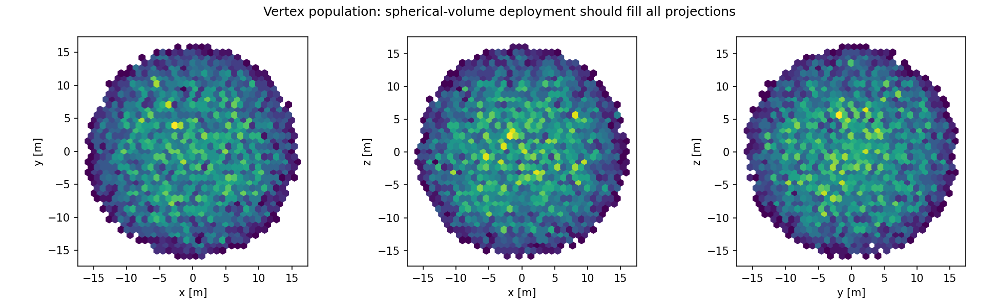

### energy_radius_coverage

能量与位置覆盖是否完整

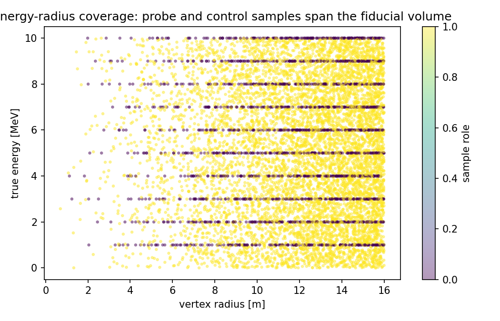

### radial_light_yield

光收集位置依赖是否可见

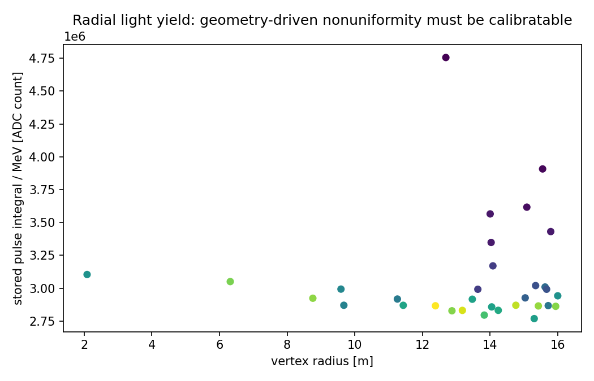

### hit_pattern_comparison

中心/边缘 hit pattern 是否不同

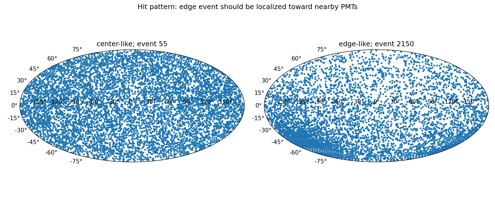

### charge_pattern_comparison

电荷空间梯度是否编码位置

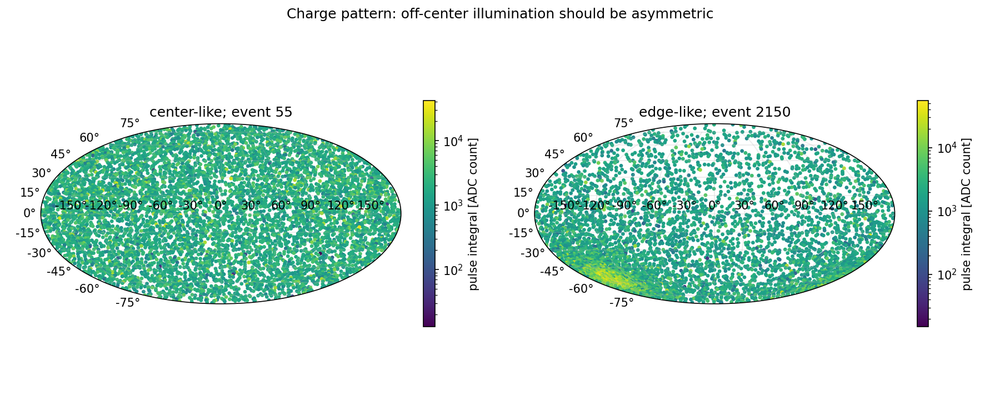

### hit_multiplicity_vs_energy

占用数是否随能量增长

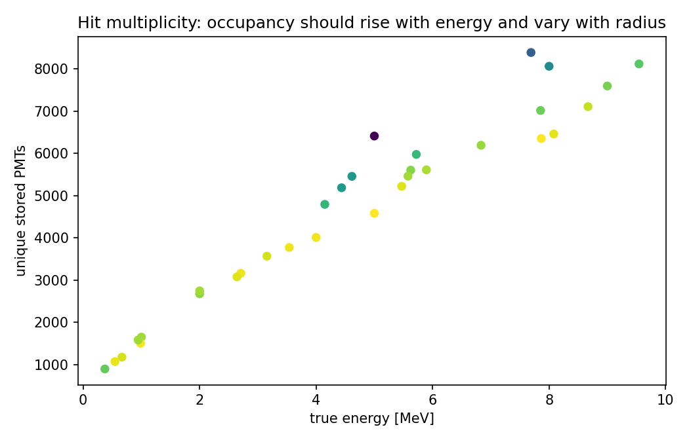

### charge_vs_energy

积分电荷是否保存能量信息

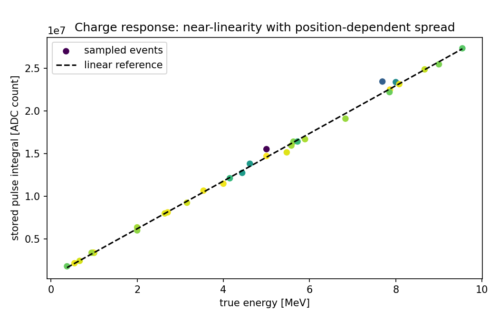

### event_anatomy

单事件空间、时间和波形是否自洽

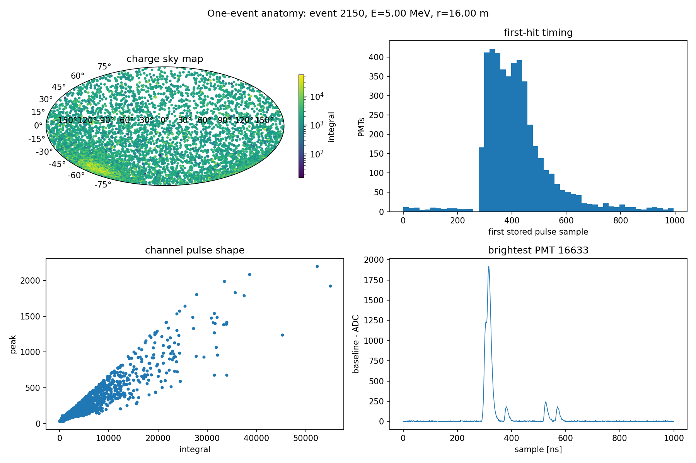

### first_hit_time

prompt 与晚光结构是否存在

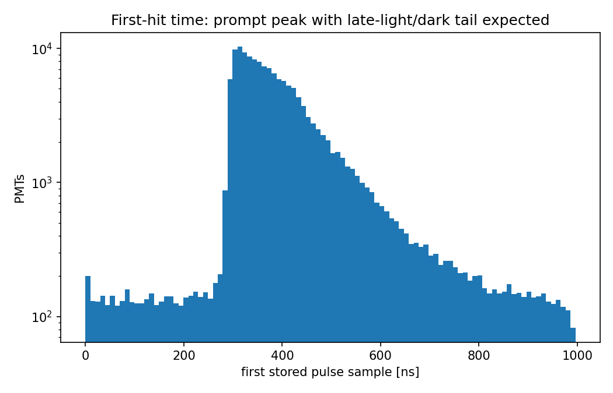

### time_vs_distance

首光是否随传播距离推迟

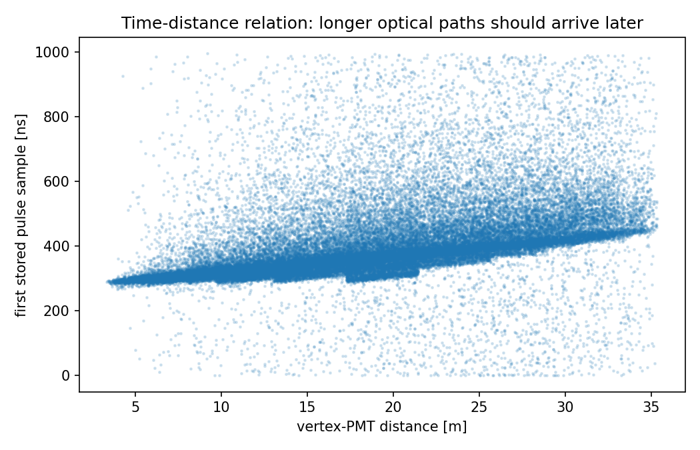

### tof_corrected_residual

TOF 校正后是否有 prompt core 和晚尾

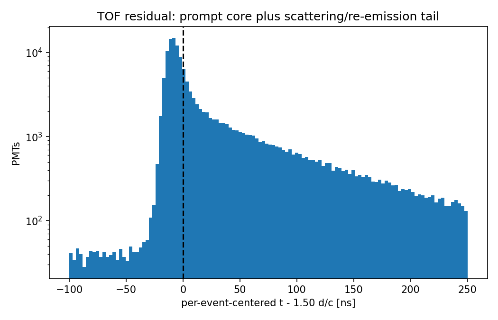

### timing_vs_radius

trigger-relative timing 是否有位置依赖

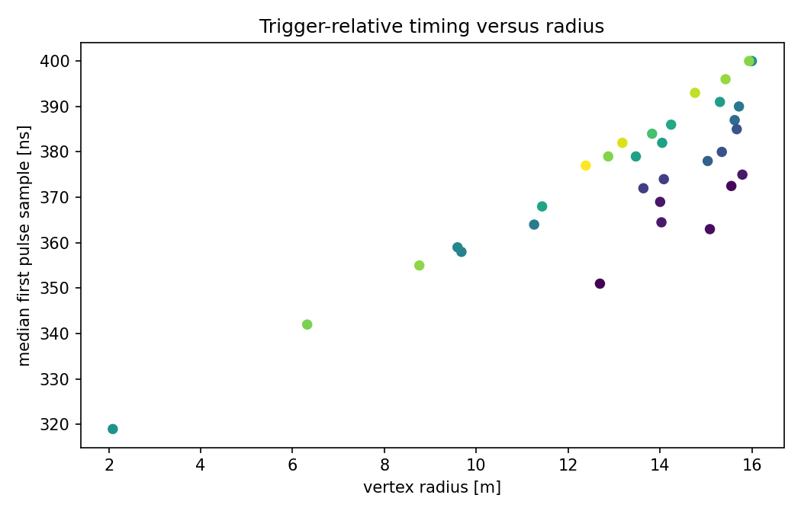

### waveform_examples

低/中/高电荷波形是否合理

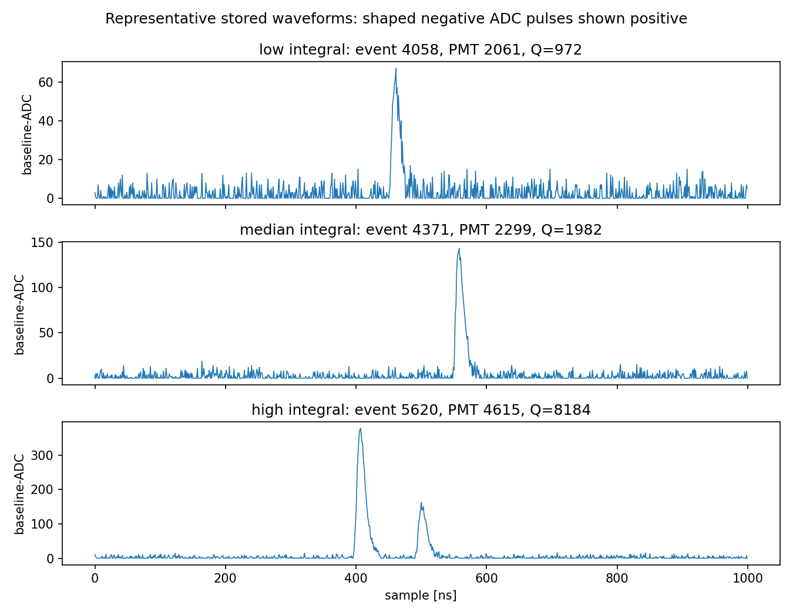

### waveform_overlays

脉冲成形模板是否稳定

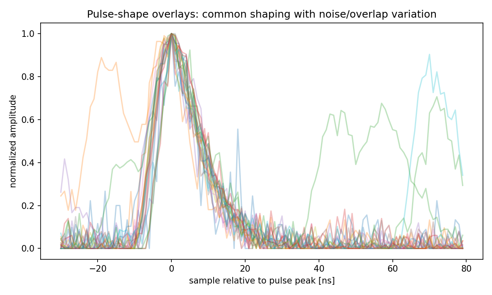

### pulse_integral_vs_peak

峰高与积分是否自洽

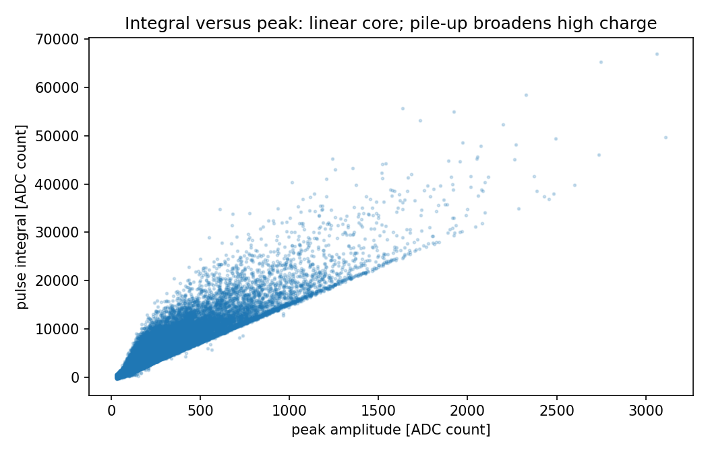

### roi_structure

稀疏 ROI 是否真正稀疏

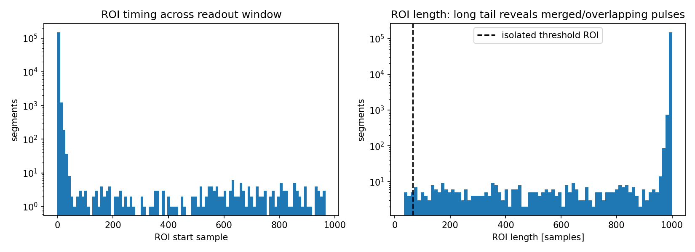
