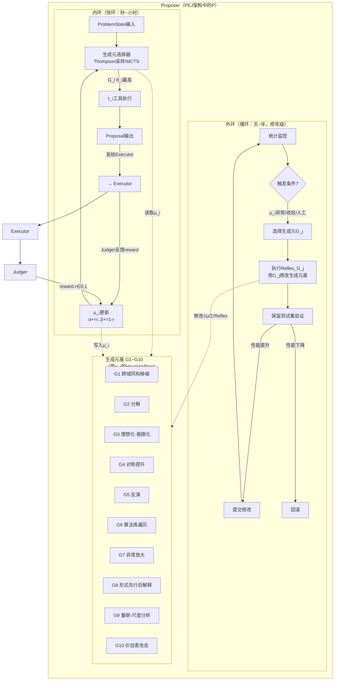

# Proposer架构设计：基于有限生成元基的递归自改进提议器

# 核心数据结构

## HeuristicPrior：生成元的统一表示

每个生成元Gᵢ表示为一个带slots的结构化对象，直接继承AM/EURISKO的知识模块传统：

```python
HeuristicPrior:
    generator_id: str          # "G1" ... "G10"
    name: str                  # "跨域同构移植" 等

    # τ_i: 动作算子——给定问题状态，产生候选提议
    tau: ToolSpec              # 工具调用规格（输入/输出/前置条件）

    # μ_i: 分域击球率——每个域的Beta先验
    # 对应EURISKO的"worth" slot，但分域而非全局
    mu: dict[str, BetaParams]  # {domain_tag: (alpha, beta)}

    # Σ_i: 更新算子——外环如何修改这个生成元
    sigma: UpdateSpec          # 参数调整/算子替换/域标签扩展

    # Reflex_i: 自反闭包映射——G_i可以作用于Proposer自身的哪个组件
    reflex: ReflexSpec         # 目标组件 + 作用方式

    # 元数据slots（继承AM/EURISKO传统）
    domain_tags: list[str]     # 适用域标签
    examples: list[Example]    # 成功/失败案例
    created_at: timestamp
    last_used_at: timestamp
    use_count: int
```

## ProblemState：问题状态

```python
ProblemState:
    domain: str                # 当前域标签（如"neutrino_physics", "code_opt"）
    assumptions: set[Formula]  # 当前假设集
    constraints: set[Constraint]  # 硬约束（物理定律、资源限制）
    evidence: list[Evidence]   # 已有证据/数据
    goal: Goal                 # 目标状态
    history: list[Attempt]     # 之前的修改尝试及结果
    open_questions: list[str]  # 未解决的问题
```

## Proposal：候选提议

```python
Proposal:
    generator_id: str          # 使用了哪个生成元
    action: Action             # 具体动作（结构化）
    rationale: str             # 为什么这一步合理（Pólya式的plausibility理由）
    expected_benefit: float    # 预期收益估计
    cost_estimate: CostBreakdown  # 估计成本（token/时间/计算）
    sub_proposals: list[Proposal]  # G2分解时的子提议
```

这直接对应AM的agenda机制——每个task附带"为什么值得做"的理由。

# 双环架构：内环搜索与外环修基

Proposer采用双环结构，直接对应生成元基定理的内环\-外环区分，也与AIDE²、AREX等2026年RSI系统的双层架构一致。

## 架构总览图



## 内环：在基上搜索

内环是Proposer的日常工作循环，每次Proposer被调用时执行：

1. **接收ProblemState**：从Executor或外部获取当前问题状态

2. **Thompson采样**：对每个生成元Gᵢ，从其当前域的Beta先验μᵢ\(domain\) = Beta\(αᵢ, βᵢ\)中采样θᵢ

3. **选择**：选θᵢ最大的生成元（也可MCTS做多步规划）

4. **执行**：调用Gᵢ的动作算子τᵢ，传入ProblemState，得到Proposal

5. **输出**：将Proposal发给Executor执行

6. **反馈更新**：Judger返回reward r ∈ \{0,1\}后，更新μᵢ：αᵢ \+= r, βᵢ \+= \(1\-r\)

## 外环：修基（修宪级操作）

外环修改生成元基本身。这是"修宪"级操作——内环只在基上搜索，外环修改搜索空间本身。

**触发条件**（满足任一）：

- 某Gᵢ在某域连续N次reward=0（μᵢ崩溃）

- 某Gᵢ在某域μᵢ收敛但总reward低于阈值（生成元失效）

- G7异常放大检测到Proposer自身行为异常（自反触发）

- G10价目表攻击发现某生成元成本\-收益比极差（自反触发）

- 人工指令

**外环操作类型**：

1. **参数调整**：修改τᵢ的超参数（如搜索深度、候选数量）

2. **算子替换**：替换τᵢ的实现（如G6换一个更好的算法匹配器）

3. **域标签调整**：细分或合并μᵢ的域标签（如"physics"细分为"particle\_physics"和"astrophysics"）

4. **生成元分裂**：G2分解一个过于宽泛的生成元为两个更精确的（自反Reflex\(G2\)）

5. **生成元合并**：G1同构移植发现两个生成元本质同构，合并之（自反Reflex\(G1\)）

6. **新生成元提议**：G8形式先行后解释发现现有基无法覆盖的模式（自反Reflex\(G8\)）

**验证与接受**：外环的每次修改必须在保留的测试问题集上运行，只有总性能提升才提交，否则回滚。这对应AIDE²的"仅当新版本得分更高时保留"和Gödel Machine的"可证明有益的自我修改"。

## 自反闭包：核心性质

自反闭包是本架构与所有静态启发式系统的本质区别。

**定义**：生成元基的域库D必须包含Proposer自身的组件集合C = \{τ₁,\.\.\.,τ₁₀, μ₁,\.\.\.,μ₁₀, 选择器, 更新器, 外环验证器\}。即每个Gᵢ的τᵢ不仅接受外部ProblemState，也接受C中的元素作为输入。

**Reflex映射**：对每个Gᵢ，定义Reflex\(Gᵢ\) = \(target\_component, action\)，说明Gᵢ作用于Proposer自身时的目标组件和具体动作。

# 生成元详细规格

本章逐一给出G1\~G10的完整规格，每个生成元包含：思想来源、τᵢ工具组件、μᵢ初始先验、Reflex\(Gᵢ\)自反闭包、输入规格、执行流程（pipeline）、输出规格，以及业界已有系统中的对应实现。十个生成元是对已存在认知操作的统一整理，不是新发明；业界系统通常实现其中若干个的组合。

## G1 跨域同构移植

**思想来源**：Pólya"你见过相关问题吗？"（1945）；Gentner结构映射理论SMT（1983）；Pólya类比启发法。

**τ₁ 工具组件**：

|工具|输入→输出|功能|
|---|---|---|
|CrossDomainRetriever<br>|ProblemState → list\[DomainCase\]<br>|在域库中检索结构相似的已解决问题。不是关键词匹配，而是通过关系结构签名（变量数、约束类型、目标形式）检索|
|StructureMappingEngine|\(source, target\) → Mapping<br>|实现Gentner SMT：找源域到目标域的关系结构同构映射。核心是map关系而非属性：如"行星绕太阳"→"电子绕核"映射的是attracts\(中心, 轨道体\)关系|
|AnalogyVerifier|\(Mapping, target\) → bool|验证移植后的结论在目标域是否成立。检查映射是否保持关键约束，标记类比失效的地方|

**μ₁初始先验**：Beta\(3,2\)（高成功率，但类比不总是成立）。在"数学证明""算法设计"域初始更高，在"精确数值预测"域初始更低。

**Reflex\(G₁\) 自反闭包**：用StructureMappingEngine在不同生成元的工具组件之间找同构。例如发现G9量纲分析的"量纲→π群→标度律"结构与G10价目表攻击的"成本列→支配项→降价候选"结构同构，则将G9的系统化步骤移植到G10，或反之。目标组件：其他Gⱼ的τⱼ。

**输入**：

- `ProblemState`：当前域的问题状态，包含目标描述`goal`、约束集`constraints`、已知条件`assumptions`、已有证据`evidence`

- 域库`DomainCaseBase`：已解决问题的结构化案例库，每个案例包含关系结构签名（变量数、约束类型层次、目标形式）和解策略

**执行流程**：

1. **结构签名提取**（CrossDomainRetriever）：将当前问题编码为关系结构签名——不是关键词，而是变量之间的约束关系图（如"n个同类对象，两两之间有对称约束，目标是找极值"）

2. **跨域检索**：在域库中检索结构签名相似的已解决案例，按结构相似度排序，取top\-K候选

3. **结构映射**（StructureMappingEngine）：对每个候选源案例，运行Gentner SMT算法，找源域→目标域的关系同构映射（映射关系而非属性），计算映射评估分数（系统性、一对一、平行连接）

4. **类比验证**（AnalogyVerifier）：检查映射是否保持关键约束，标记类比失效的关系（"这一点在目标域不成立"）

5. **策略移植**：选映射质量最高的候选，将源域的解策略通过映射翻译到目标域，生成候选行动

**输出**：`Proposal(generator_id="G1", action=移植后的具体行动, rationale="源域X中问题Y通过策略Z解决，当前问题与Y结构同构（映射关系：...），因此移植Z", expected_benefit, cost_estimate)`

**业界已有实现对应**：

|系统/方法|年份|对应G1的机制|
|---|---|---|
|AgentKB|2025|"推理\-检索\-精炼"（Reason\-Retrieve\-Refine）pipeline，从过去问题解决经验中检索结构相似案例，将成功策略跨任务迁移|
|SciAgents|2024|知识图谱上的随机路径采样（Random Path Sampling），跨域概念组合生成科学假设|
|BioSage|2025|跨学科知识检索与综合，从多个生物医学领域过滤和整合文献——偏检索综合而非严格结构映射，但实现了跨域知识迁移|

## G2 分解

**思想来源**：笛卡尔还原论（1637，《方法论》第二条：把难题分解为小部分）；Pólya分解启发法（1945）；TRIZ第1号发明原理"分割"（1956）。

**τ₂ 工具组件**：

|工具|输入→输出|功能|
|---|---|---|
|ProblemDecomposer|ProblemState → list\[Subproblem\]|将问题分解为可独立求解的子问题。支持多种分解策略：按时间阶段、按空间组件、按抽象层次、按独立变量|
|SubproblemScheduler|list\[Subproblem\] → DAG|分析子问题间的依赖关系，安排求解顺序（拓扑排序），识别可并行的子问题|
|InterfaceSynthesizer|list\[SolvedSubproblem\] → Solution|将子问题的解合成为原问题的解。处理子问题间的接口约束、冲突消解、一致性检查|

**μ₂初始先验**：Beta\(4,1\)（最高成功率之一，分解是最可靠的启发式）。在"工程系统""复杂证明"域尤其高。

**Reflex\(G₂\) 自反闭包**：用ProblemDecomposer分解Proposer自身过于宽泛的生成元。例如发现G6"算法库遍历"在不同域行为差异巨大，可将其拆为"数值算法匹配""组合算法匹配""ML算法匹配"三个更精确的生成元。目标组件：生成元基本身（新增/分裂Gᵢ）。

**输入**：

- `ProblemState`：复杂问题状态，目标`goal`过于复杂无法直接求解

- 分解策略库：按时间阶段、按空间组件、按抽象层次、按独立变量的分解模式

**执行流程**：

1. **分解策略选择**（ProblemDecomposer）：分析问题结构，选择最合适的分解维度（如物理系统按组件分，证明按引理分，优化问题按变量组分）

2. **子问题生成**：将原问题分解为若干可独立求解的子问题，每个子问题有自己的子目标、子约束、接口要求

3. **依赖分析**（SubproblemScheduler）：分析子问题间的数据流和约束依赖，构建依赖DAG

4. **调度排序**：对DAG做拓扑排序，识别可并行求解的子问题，确定求解顺序

5. **接口定义**（InterfaceSynthesizer）：定义子问题间的接口契约（输入输出格式、一致性约束）

6. **递归求解**：对每个子问题递归调用Proposer（G2可自嵌套），得到子Proposal

**输出**：`Proposal(generator_id="G2", action=分解方案+调度计划, sub_proposals=[子Proposal列表], rationale="原问题可分解为独立子问题A/B/C，A和B可并行，C依赖A/B的结果", ...)`

**业界已有实现对应**：

|系统/方法|年份|对应G2的机制|
|---|---|---|
|DyFlow|2025|designer将复杂问题分解为子目标序列，根据中间输出和反馈动态规划下一步，executor执行每个操作|
|OWL/Workforce|2025|域无关Planner做任务分解，Coordinator管理子任务，专业Worker执行，支持跨域迁移|
|Co\-Scientist|2026|supervisor agent将高层研究目标分解为可执行步骤，协调专门agent联盟|
|ALMC|2025|Manager Agent综合任务特定角色组合和可执行工作流，Judge评估质量，Solution Optimizer复用优质配置|

## G3 理想化\-极限化

**思想来源**：伽利略思想实验（\~1600，无摩擦斜面）；Pólya特殊化与一般化（1945）；TRIZ理想最终结果IFR（1956）。

**τ₃ 工具组件**：

|工具|输入→输出|功能|
|---|---|---|
|LimitAnalyzer|\(ProblemState, param\) → LimitCase|将指定参数推到极限（0, ∞, \-∞, 对称点），分析极限情况下问题的简化形式。如：摩擦→0、维数→∞、温度→0K|
|ThoughtExperimentBuilder|LimitCase → IdealizedModel|构造理想化模型：无耗散系统、完美导体、无限总体、瞬时平衡。在理想模型中求解通常容易得多|
|PerturbationExpander|\(IdealizedModel, ε\) → Series|从理想解出发，对小参数ε做微扰展开，得到现实情况的近似解。这是物理学中最常用的近似方法|

**μ₃初始先验**：Beta\(3,2\)。在"物理建模""渐近分析"域高，在"离散数学""精确计数"域低。

**Reflex\(G₃\) 自反闭包**：用LimitAnalyzer理想化Proposer自身的运行条件。例如：假设计算预算→∞时Proposer应该怎样（答案：穷举所有生成元的所有可能应用，选最优）；假设Judger完美时内环策略应怎样（答案：纯exploitation不需要exploration）；假设延迟→0时批处理策略应怎样。这些极限分析指导外环优化实际条件下的策略。目标组件：选择器策略、内环参数。

**输入**：

- `ProblemState`：含可调参数的问题，参数空间中有小参数或可取极限的量

- 理想化模型模板：无耗散系统、无限总体、完美导体、瞬时平衡、无摩擦等

**执行流程**：

1. **参数识别**（LimitAnalyzer）：识别问题中可调参数，选择关键参数推到极限值（0, ∞, \-∞, 对称点）

2. **极限分析**：分析极限情况下问题的简化形式——哪些项消失、哪些约束退化、哪些自由度解耦

3. **理想模型构造**（ThoughtExperimentBuilder）：在极限情况下构造理想化模型（如摩擦→0得保守系统，维数→∞得平均场，温度→0K得基态问题）

4. **理想解求解**：在理想模型中求解（通常比原问题容易得多，可能有解析解）

5. **微扰展开**（PerturbationExpander）：从理想解出发，对小参数ε做微扰展开（正则微扰/奇异微扰/WKB），得到现实情况的近似解序列

**输出**：`Proposal(generator_id="G3", action=理想解+微扰修正方案, rationale="在ε→0极限下问题简化为X，其解为Y₀，对ε展开得Y≈Y₀+εY₁+...", ...)`

**业界已有实现对应**：

|系统/方法|年份|对应G3的机制|
|---|---|---|
|KeplerAgent|2026|先在简化物理设置中提取中间结构（对称性、量纲），再用这些结构配置符号回归引擎|
|AI\-Newton|2025|概念驱动发现系统，先在理想化设置中自主定义概念（如"力""质量"），再推导一般定律|
|PhysMaster|2025|理论推理\+数值计算双能力Agent，在理论分析中使用极限情况和近似方法|

**注**：G3在当前AI Agent系统中实现较少，因为它需要深层物理/数学直觉。多数系统通过"先解决toy problem再推广"的prompting策略隐式使用，但没有像G1/G2/G8那样的显式工具化实现。

## G4 对称提升

**思想来源**：Noether定理（1918，连续对称→守恒律）；爱因斯坦相对论方法论（1905\-15，洛伦兹协变→狭义相对论，广义协变→广义相对论）；外尔规范对称（1918/1929）。

**τ₄ 工具组件**：

|工具|输入→输出|功能|
|---|---|---|
|SymmetryDetector|ProblemState → list\[Symmetry\]|检测问题中隐含的对称性：置换不变性、时间反演、空间旋转/平移、标度变换、规范对称、对偶性|
|InvariantFinder|Symmetry → Invariant|对每个检测到的对称，找对应的不变量/守恒量（Noether构造）。如时间平移→能量守恒，空间平移→动量守恒|
|Covariantizer|\(NonCovariantFormula, Symmetry\) → CovariantFormula|将非协变的表达式提升为协变形式。即重写公式使其在对称变换下保持形式不变——这是爱因斯坦从狭义到广义相对论的核心方法|

**μ₄初始先验**：Beta\(2,2\)（中等，对称性不是每个问题都有，但一旦有就极其有力）。在"理论物理""群论问题"域高，在"杂乱工程数据"域低。

**Reflex\(G₄\) 自反闭包**：用SymmetryDetector找Proposer工作流中的对称性。例如发现选择器对Gᵢ的排列不变（即不依赖生成元编号），则可安全地并行评估多个生成元；发现μᵢ更新规则对reward的时间反演对称（即正反例同等对待），则可优化为增量更新。目标组件：选择器、μᵢ更新器。

**输入**：

- `ProblemState`：含公式/模型/拉格朗日量/哈密顿量的问题

- 对称群模板库：置换群S\_n、时间反演T、空间群E\(3\)、标度变换、规范群U\(1\)/SU\(2\)/SU\(3\)、对偶变换

**执行流程**：

1. **对称性检测**（SymmetryDetector）：扫描问题表达式，检测隐含的对称性——变量置换下表达式是否不变、时间反演是否保持方程、是否有旋转/平移不变性、是否有标度不变性

2. **不变量构造**（InvariantFinder）：对每个检测到的连续对称，用Noether定理构造守恒量/不变量（时间平移→能量，空间平移→动量，旋转→角动量，U\(1\)规范→电荷）

3. **协变化**（Covariantizer）：将非协变的表达式重写为协变形式——即重写公式使其在对称变换下保持形式不变（如将三维矢量方程提升为四维张量方程，将非规范不变的拉格朗日量补为规范不变的）

4. **对称约化**：利用不变量减少自由度（如用守恒量降阶ODE，用对称性缩小搜索空间）

**输出**：`Proposal(generator_id="G4", action=对称约化后的问题/协变公式/守恒律, rationale="问题在X变换下不变，对应守恒量Y，解空间可约化为Z维", ...)`

**业界已有实现对应**：

|系统/方法|年份|对应G4的机制|
|---|---|---|
|等变神经网络（EGNN, SE\(3\)\-Transformer, Equivariant GNN）|2021\-2025|将旋转/平移/置换对称性硬编码到网络架构中，自动满足协变性，用于分子动力学、粒子物理|
|KeplerAgent|2026|显式检测物理对称性，用对称性约束配置PySINDy/PySR的函数库|
|程序验证不变量生成|经典|在形式化验证中自动生成循环不变量，对应InvariantFinder的离散版本|

**注**：G4的Covariantizer（将非协变形式提升为协变）在AI系统中几乎没有显式实现——这是爱因斯坦式的方法论飞跃，当前AI更多是将对称性作为硬约束/归纳偏置，而非主动"提升"对称性。

## G5 反演

**思想来源**：数学归谬法（古希腊，欧几里得《几何原本》）；Pólya倒推法/归谬法（1945，"从结论往回推"）；TRIZ第13号发明原理"反向"（1956）。

**τ₅ 工具组件**：

|工具|输入→输出|功能|
|---|---|---|
|ReductioEngine|Claim → Contradiction|假设结论不成立，推导矛盾。标准归谬法：¬P → \(Q ∧ ¬Q\)，则P成立|
|BackwardChainer|Goal → list\[Precondition\]|从目标倒推：要证G，需要先证A和B；要证A需要\.\.\.直到到达已知条件。Pólya称之为"倒着干"|
|DualProblemGenerator|Problem → DualProblem|构造对偶问题：最大化↔最小化、存在↔任意、并↔交、原问题↔对偶问题。对偶问题的解常给出原问题的界或 insight|

**μ₅初始先验**：Beta\(3,2\)。在"数学证明""逻辑推理""优化问题"域高，在"构造性问题"域中等。

**Reflex\(G₅\) 自反闭包**：用DualProblemGenerator反演Proposer的选择逻辑。正问题："在当前状态下应该选哪个Gᵢ？"对偶问题："在什么条件下不应该选Gᵢ？"后者给出每个生成元的禁用条件，比正面条件更容易刻画。用ReductioEngine证明某个μᵢ更新规则的收敛性：假设不收敛→推出矛盾→证明收敛。目标组件：选择器禁用条件、Σᵢ正确性证明。

**输入**：

- `ProblemState`：含待证命题`claim`或优化目标`goal`的问题

- 反演策略库：归谬法模板、后向链规则、对偶变换模式

**执行流程**：

1. **策略选择**：根据问题类型选择反演策略——证明题用归谬法/后向链，优化题用对偶问题

2. **归谬路径**（ReductioEngine）：假设结论¬P成立，与前提合并，向前推导直到得到矛盾Q∧¬Q，则P得证

3. **后向链路径**（BackwardChainer）：从目标G出发，查找结论为G的规则，将G归约为前提A∧B；递归归约A和B，直到所有子目标都是已知条件（LAMBADA式后向链）

4. **对偶路径**（DualProblemGenerator）：构造对偶问题（max↔min, ∃↔∀, ∪↔∩, primal↔dual），解对偶问题得到原问题的界或解

5. **结果翻译**：将反演得到的结果翻译回原问题的正向证明/解

**输出**：`Proposal(generator_id="G5", action=证明路径/对偶解, rationale="假设¬P导致矛盾（具体矛盾点），故P成立" 或 "要证G需先证A和B，A可由...直接得到", ...)`

**业界已有实现对应**：

|系统/方法|年份|对应G5的机制|
|---|---|---|
|Aristotle|2025|Decompose\-Search\-Resolve框架，Search Router使用反证法（proof by contradiction）发现逻辑冲突|
|LoT/Logical Thoughts prompting|2023|利用归谬法（Reductio ad Absurdum）系统地逐步验证和纠正推理过程|
|DIR/Direct\-Indirect Reasoning|2024|逆否命题等价\+反证法模板，触发LLM假设结论否定并推导矛盾|
|LAMBADA|2022|后向链推理：从目标递归分解子目标，直到子目标可由事实证明或否定|
|Dual\-Phase LLM Reasoning|2026|将验证、回溯、子目标设置、后向链集成到多轮对话推理中|

## G6 算法库遍历

**思想来源**：Newell \& Simon手段\-目的分析（GPS, 1957）：比较当前状态与目标的差异，选择缩小差异的算子；Pólya辅助问题启发法（1945）："你知道一个相关的问题吗？这里有一个以前解过的问题，你能利用它吗？"

**τ₆ 工具组件**：

|工具|输入→输出|功能|
|---|---|---|
|AlgorithmMatcher|ProblemFeatures → list\[Algorithm\]|将问题特征（离散/连续、凸/非凸、有/无梯度、数据规模、精度要求）与已知算法库匹配。类似GPS的"差异→算子"表|
|ComplexityEstimator|\(Algorithm, ProblemSize\) → Complexity|估计算法在当前问题规模下的时间/空间复杂度，排除不可行的算法|
|AdapterGenerator|\(Algorithm, ProblemSpec\) → Code|生成将算法适配到当前问题的粘合代码：数据格式转换、参数绑定、结果后处理|

**μ₆初始先验**：Beta\(4,2\)（高成功率，尤其在有成熟算法库的领域）。在"数值计算""组合优化""标准ML任务"域极高，在"全新科学问题"域较低。

**Reflex\(G₆\) 自反闭包**：用AlgorithmMatcher为Proposer自身选择更好的内环搜索算法。例如：当生成元数K=10固定时，Thompson采样是最优；但如果外环新增了生成元（K增大），可能需要切换到MCTS多步规划；当μᵢ先验信息少时用ε\-greedy，信息多时用UCB。用ComplexityEstimator分析不同选择策略的计算开销。目标组件：内环选择器策略。

**输入**：

- `ProblemState`：含问题特征的结构化描述（变量类型、约束性质、目标函数性质、数据规模、精度要求）

- 算法库`AlgorithmLibrary`：已知算法的规格书（适用条件、复杂度、参数、实现接口）

**执行流程**：

1. **特征提取**（AlgorithmMatcher）：从ProblemState提取问题特征——离散/连续/混合、凸/非凸、有无梯度/海森矩阵、数据规模N、维度D、精度要求ε、是否有噪声

2. **算法匹配**：将问题特征与算法库中每个算法的适用条件匹配，得到候选算法列表（类似GPS的"差异→算子"表）

3. **复杂度筛选**（ComplexityEstimator）：对每个候选算法，估计在当前\(N,D,ε\)下的时间/空间复杂度，排除不可行的（如O\(N³\)在N=10⁶时不可行）

4. **适配代码生成**（AdapterGenerator）：为选定算法生成粘合代码——数据格式转换、参数绑定（如学习率、正则化系数）、初始化、结果后处理

5. **排序输出**：按"适用性×效率×实现成本"排序，输出最优算法及其适配方案

**输出**：`Proposal(generator_id="G6", action=选定算法名+适配代码+参数配置, rationale="问题特征为X，算法Y适用（复杂度O(...)，在当前规模下可行）", ...)`

**业界已有实现对应**：

|系统/方法|年份|对应G6的机制|
|---|---|---|
|GPS \(General Problem Solver\)|1957|Newell \& Simon的手段\-目的分析：比较当前状态与目标状态的差异，选择缩小差异的算子，是G6的直接先驱|
|OWL/Workforce|2025|专业Worker agents各有特定工具调用能力，Coordinator根据任务调度合适的Worker|
|AutoML系统（Auto\-sklearn, TPOT, H2O）|2013\-2024|自动算法选择\+超参调优，元学习根据数据集特征推荐算法|
|KernelAgent|2026|多Agent编排，根据硬件特征和kernel profile自动选择和优化GPU kernel实现|
|Function\-calling/Tool\-use LLM框架|2023\-2026|各类tool\-use agent（GPT function calling, LangChain tools等）本质上是G6的通用化实现|

## G7 异常放大

**思想来源**：波普尔证伪主义（《科学发现的逻辑》, 1934）：科学通过反驳进步，一个反例比一千个确证更有价值；库恩（《科学革命的结构》, 1962）：反常积累→危机→范式转换。历史案例：黑体辐射紫外灾难→量子论；迈克尔逊\-莫雷零结果→相对论；彭齐亚斯\-威尔逊天线噪声→CMB。

**τ₇ 工具组件**：

|工具|输入→输出|功能|
|---|---|---|
|ResidualDetector|\(Theory, Data\) → list\[Residual\]|计算理论预测与观测数据之间的残差，按统计显著性排序。不是忽略异常值，而是主动放大它们|
|AnomalyRanker|list\[Residual\] → list\[RankedAnomaly\]|按重要性排序异常：统计显著性×理论重要性×可重复性。最大的异常最可能指向新物理|
|CounterexampleGenerator|Conjecture → Counterexample|主动搜索猜想的反例：极端参数区、边界情况、退化情形。波普尔式的"严格检验"|

**μ₇初始先验**：Beta\(2,3\)（成功率低但收益极高——大多数异常是噪声，但一旦是真异常就是革命）。在"实验科学""数据分析"域中等，在"形式证明"域由CounterexampleGenerator主导。

**Reflex\(G₇\) 自反闭包**：用ResidualDetector检测Proposer自身的行为异常。例如：某Gᵢ在某域的μᵢ突然骤降（残差=预期成功率\-实际成功率）→触发外环调查；某生成元产生的Proposal被Judger拒绝的模式有系统性偏差→该生成元的τᵢ可能有bug；选择器在某类问题上总选同一个Gᵢ但成功率低→μᵢ先验可能过拟合。目标组件：μᵢ监控、τᵢ正确性。

**输入**：

- 路径A（数据驱动）：当前理论/模型`Theory` \+ 观测数据`Data`

- 路径B（猜想驱动）：待检验猜想`Conjecture`

**执行流程**：

1. **残差计算**（ResidualDetector）：计算理论预测与观测数据之间的逐点残差r\_i = y\_i \- f\(x\_i\)，按统计显著性（\|r\_i\|/σ\_i）排序

2. **异常排序**（AnomalyRanker）：按"统计显著性 × 理论重要性 × 可重复性"三因子乘积排序异常——大残差出现在理论核心区域比出现在边缘更重要，可重复的异常比一次性异常更重要

3. **反例搜索**（CounterexampleGenerator）：对猜想主动构造反例——极端参数区、边界情况、退化情形、对称性破缺点；这是波普尔式的"严格检验"

4. **异常放大**：将排名最高的异常/反例放大为新假设的起点——不是丢弃异常值，而是将其视为新物理/新理论的信号

**输出**：`Proposal(generator_id="G7", action=异常驱动的新假设/修正猜想/反例, rationale="理论在X区域的残差达Yσ，超过Zσ阈值，可能指示新效应；猜想在极端情况W下不成立", ...)`

**业界已有实现对应**：

|系统/方法|年份|对应G7的机制|
|---|---|---|
|Co\-Scientist|2026|Critic agent提供批评评估，在idea tournament中识别假设漏洞，弱假设被淘汰|
|Bayes\-Entropy Collaborative Agents|2025|Counterfactual机制：假设被证据强烈反驳时，通过否定因果声明或提出替代解释框架生成反假设|
|HypoAgent|2026|Root Cause Analysis Agent诊断失败假设，分解为可执行片段检查KG支持，探测邻域缺失关系|
|Self\-Rewarding / Meta\-Rewarding / STOP|2024\-2025|自我批判/自我奖励机制，LLM充当自己的critic，识别并修正自己输出中的缺陷|
|AREX|2026|外层自改进循环逐条约束审计，发现内循环答案违反约束时触发修正|

## G8 形式先行后解释

**思想来源**：狄拉克"数学美原理"（1963年莫斯科大学题字："Physical laws should have mathematical beauty"）：先追求方程的数学美，再找物理解释。历史案例：狄拉克方程（1928）→正电子预言（1931安德森发现）；外尔规范理论（1918）→杨\-米尔斯（1954）→标准模型。

**τ₈ 工具组件**：

|工具|输入→输出|功能|
|---|---|---|
|PatternGuesser|Data → Formula|从数值数据猜测解析形式：幂律、指数、有理函数、三角函数组合。不假设物理意义，纯形式拟合|
|SymbolicRegressor|Data → SymbolicExpr|符号回归：在形式语言空间中搜索简洁且拟合好的表达式。简约性优先（奥卡姆剃刀的形式化）|
|PostHocInterpreter|SymbolicExpr → Interpretation|为已发现的形式关系找物理解释：这一项对应什么物理量？这个对称性意味着什么？这个极限对应什么已知现象？|

**μ₈初始先验**：Beta\(2,3\)（低成功率但高impact——大多数形式拟合是过拟合，但偶尔发现真定律）。在"经验科学""数据驱动发现"域中等，在"纯形式数学"域由PatternGuesser主导。

**Reflex\(G₈\) 自反闭包**：用SymbolicRegressor为Proposer的内部状态发现形式化规律。例如：记录各Gᵢ在不同域的μᵢ值，发现μᵢ与问题特征的解析关系（如"G4在对称群大小\>4的域成功率\~0\.8"）；发现内环收敛速度与问题参数的标度关系；发现外环触发频率与μᵢ熵的函数关系。这些形式规律指导Σᵢ的设计。目标组件：μᵢ元规律、选择策略的形式化。

**输入**：

- `ProblemState`：含数值数据`Data = {(x_i, y_i)}`或经验观察，变量列表`variables`

- 形式语言模板：数学运算符集（\+, \-, ×, ÷, ^, exp, log, sin, \.\.\.）、复杂度惩罚权重

**执行流程**：

1. **形式猜测**（PatternGuesser）：从数据的数值模式猜测解析形式——双对数坐标下线性→幂律、半对数坐标下线性→指数、周期性→三角函数组合。不假设物理意义，纯形式拟合

2. **符号回归**（SymbolicRegressor）：在形式语言空间中搜索简洁且拟合好的表达式。搜索算法可以是遗传编程（PySR）、稀疏回归（SINDy）、MCTS、或LLM驱动的进化搜索；以"拟合精度 × 简洁性"为目标（奥卡姆剃刀的形式化）

3. **形式验证**：在留出数据上验证发现的公式，检查量纲一致性（与G9交互）、极限行为合理性（与G3交互）

4. **事后解释**（PostHocInterpreter）：为已发现的形式关系找物理解释——这一项对应什么物理量？这个指数反映什么机制？这个对称性意味着什么守恒律？这个极限对应什么已知现象？

**输出**：`Proposal(generator_id="G8", action=符号公式+物理解释, rationale="数据最佳拟合为y = a·x^b（R²=...，复杂度=...），其中b≈3/2提示...机制", ...)`

**业界已有实现对应**：

|系统/方法|年份|对应G8的机制|
|---|---|---|
|SR\-Scientist|2025|LLM从方程提议者升级为自主AI科学家：写代码分析数据、实现方程、提交评估、根据反馈迭代优化|
|LLM\-SR|2024|将方程视为程序，结合LLM科学先验与进化搜索，迭代提出新方程骨架并优化参数|
|PySR / PySINDy|2020\-2024|经典符号回归引擎：遗传编程/稀疏识别非线性动力学，是SymbolicRegressor的标准实现|
|KeplerAgent|2026|物理引导：先用物理工具提取中间结构，再配置PySINDy/PySR的函数库和结构约束|
|AI\-Newton|2025|北大概念驱动发现系统，从含噪声原始数据自主定义概念并推导物理定律（重新发现牛顿第二定律）|
|SLDAgent \(Scaling Law Discovery\)|2026|基于进化的Agent，联合优化标度律模型和参数，自动发现跨实验的标度关系|
|PhyE2E|2025|清华Nature MI论文，神经符号模型，端到端生成、分解并优化物理公式|
|IGSR \(Influence\-Guided SR\)|2026|LLM生成候选基函数，用影响分数Δj量化各项边际贡献，MCTS\+影响引导剪枝|
|LiteSR|2025|文献Agent构建结构化文献上下文，符号求解器Agent迭代搜索最优方程|

## G9 量纲\-尺度分析

**思想来源**：Buckingham π定理（1914，NIST历史上被引最多的论文）：n个物理量k个基本量纲→n\-k个无量纲π数控制物理；雷诺数、临界现象标度律、异速生长律、费米估算。

**τ₉ 工具组件**：

|工具|输入→输出|功能|
|---|---|---|
|DimensionalChecker|Formula → DimensionalAnalysis|检查公式量纲一致性，标记量纲错误。自动推断各量的量纲矩阵|
|PiTheoremCalculator|list\[Quantity\] → list\[PiGroup\]|应用Buckingham π定理：给定量纲矩阵，计算零空间基向量，得到无量纲π数。物理关系必为π数之间的函数关系|
|ScalingLawInferrer|\(Data, PiGroups\) → ScalingLaw|从数据推断π数之间的标度关系：幂律π₁ \~ π₂ᵅ、临界指数、跨尺度不变性|

**μ₉初始先验**：Beta\(3,2\)。在"物理建模""工程估算""复杂系统标度"域高，在"纯离散数学""符号逻辑"域低。

**Reflex\(G₉\) 自反闭包**：用PiTheoremCalculator分析Proposer自身参数空间的量纲结构。Proposer的"量"包括：问题规模N、计算预算B、生成元数K、内环迭代次数T、域数D、μᵢ的熵H。基本"量纲"：信息量（bit）、时间（s）、计算量（FLOP）。π定理给出无量纲组合如B/\(N·K\)（每问题每生成元预算）、T·H/K（选择器信息量），这些π数控制Proposer的性能标度。目标组件：Proposer自身参数的标度律、外环资源分配策略。

**输入**：

- `ProblemState`：含物理量列表`quantities = {name, value, dimension}`，量纲采用MLTΘ基本量纲体系（质量M、长度L、时间T、温度Θ）

- 可选：实验数据`Data`用于推断标度律

**执行流程**：

1. **量纲检查**（DimensionalChecker）：构建量纲矩阵（行=基本量纲M/L/T/Θ，列=物理量），检查目标公式的量纲一致性，标记量纲错误

2. **π定理计算**（PiTheoremCalculator）：计算量纲矩阵的零空间（null space），得到n\-k个无量纲π数（n=物理量数，k=量纲矩阵秩）。物理关系必为f\(π₁, π₂, \.\.\., π\_\{n\-k\}\) = 0

3. **π数选择**：选择物理上最有意义的π数组合（如雷诺数Re=ρvL/μ、马赫数Ma=v/c、努塞尔数Nu）

4. **标度律推断**（ScalingLawInferrer）：如有数据，推断π数之间的幂律关系π₁ \~ C·π₂^α·π₃^β\.\.\.，确定临界指数

5. **量纲约化**：用量纲分析约束解的形式（如"答案必须是ρv²的量级"），或用标度律做跨尺度外推

**输出**：`Proposal(generator_id="G9", action=无量纲π数列表+标度律+量纲一致性检查结果, rationale="n个量k个基本量纲→n-k个π数：π₁=..., π₂=...；数据表明π₁~π₂^α", ...)`

**业界已有实现对应**：

|系统/方法|年份|对应G9的机制|
|---|---|---|
|SciAgents \(2508\.20729\)|2025|Programmer Agent显式使用Buckingham π定理，网格搜索无量纲数，偏好小有理指数（\-1, 1, 2），系数绝对值\<4|
|KeplerAgent|2026|物理工具提取量纲和中间结构，用这些约束配置符号回归引擎的函数库|
|SLDAgent|2026|自动发现标度律，联合优化标度律模型形式和参数|
|NewtonBench|2025|科学定律发现benchmark（非实现系统），评估标准中包含量纲一致性检查|
|PhysMaster|2025|理论物理Agent，在解析推导中使用量纲分析和标度论证|

## G10 价目表攻击

**思想来源**：价目表攻击是一种朴素的成本优化直觉——把系统每项操作的成本像价目表一样逐项列出，找到占总成本最大的那一项（支配项），然后专门针对它想办法降价。三步：读账本成本列 → 找支配项 → 生成降价候选。它不依赖特定的运筹学定理，而是"先看钱花在哪了，再砍最大的那笔"这种基本策略的形式化。

**τ₁₀ 工具组件**：

|工具|输入→输出|功能|
|---|---|---|
|CostReader|System → CostLedger|"读账本"：逐项列出系统各组件的成本（token消耗、执行时间、内存、API调用次数），输出一张成本明细表。不做分析，只把账记清楚|
|DominantTermFinder|CostLedger → DominantTerm|"找支配项"：在成本明细中找占比最大的那一项。就是最大的那个数，不需要复杂模型——如果一项占了总成本的50%以上，它就是支配项|
|CostReductionGenerator|DominantTerm → list\[Reduction\]|"生成降价候选"：针对支配项，生成让它变便宜的具体办法：换更便宜的算法、加缓存、剪枝、近似计算、延迟调用、换硬件|

**μ₁₀初始先验**：Beta\(4,1\)（高成功率——任何运行中的系统都有成本分布，最大成本项几乎总是存在，攻击它几乎总能降本）。在"系统优化""资源分配""计算预算管理"域极高。

**Reflex\(G₁₀\) 自反闭包**：用CostReader读Proposer自身的成本账——每个Gᵢ的τᵢ调用一次花多少token/时间。用DominantTermFinder找最昂贵但μᵢ最低的生成元（花得多、成得少），用CostReductionGenerator生成让它降价的办法（缓存、剪枝、条件触发、替换实现），或提议外环直接淘汰它。目标组件：生成元的成本\-收益比、τᵢ效率、外环淘汰/替换决策。

**G10自反示例**：CostReader显示G8（形式先行后解释）的SymbolicRegressor每次调用消耗12K tokens但μ₈=0\.15（在当前域），而G9（量纲分析）每次消耗0\.5K tokens且μ₉=0\.6。DominantTermFinder标记G8为支配成本项。CostReductionGenerator提议：\(a\) 缓存G8的符号回归结果；\(b\) 仅在G9标记"有未解释标度律"时才调用G8；\(c\) 用更轻量的模式匹配替代完整符号回归。这些提议由外环验证后提交。

**输入**：

- `SystemState`：当前系统运行状态，含各组件的成本指标（token消耗、执行时间、内存占用、API调用次数）

- 成本单位换算：不同成本类型如何折算到统一尺度（如1 token = $X，1秒 = $Y）

**执行流程**：

1. **读账本成本列**（CostReader）：逐项测量/收集系统各组件的成本，输出一张成本明细表——每一行是一个组件或操作，每一列是一种成本维度。不做判断，只把数列清楚

2. **找支配项**（DominantTermFinder）：在总成本中找占比最大的那一项。如果一项明显大于其他项（比如超过其余项之和），它就是支配项，攻击它收益最大

3. **生成降价候选**（CostReductionGenerator）：针对支配项， brainstorm具体的降价手段——能不能用更便宜的算法替代？能不能缓存结果避免重复计算？能不能剪枝跳过不必要的搜索？能不能只在必要时才调用？能不能用近似代替精确？每个候选附带预期降价幅度

**输出**：`Proposal(generator_id="G10", action=针对支配项的降价方案, rationale="组件X占总成本Y%，是支配项；用方案Z可将其成本降低W%，预期总成本降低V%", ...)`

**业界已有实现对应**：

当前业界没有一个系统将"读账本→找支配项→生成降价候选"作为通用启发式显式实现。相关但不等同的工作：

|系统/方法|年份|与G10的关系|
|---|---|---|
|传统profiling工具（cProfile, py\-spy, torch\.profiler, nsys, perf）|持续|只做了第一步"读账本"——提供成本分解数据。不自动找支配项，也不生成降价候选|
|AutoKernel / KernelAgent|2026|在GPU kernel优化这个特定领域做了profiling\+优化，但领域特定，不是通用的价目表攻击|

完整的"读账本→找支配项→生成降价候选"闭环在当前AI Agent系统中没有明确对应。

## 业界实现覆盖度总结

下表汇总G1\~G10在业界已有系统中的实现覆盖情况。注意：

- ✔ = 有显式工具化实现

- ◐ = 有隐式/prompting级实现，但未工具化

- ✗ = 当前业界系统中基本没有对应实现

|编号|生成元|业界实现覆盖|
|---|---|---|
|G1|跨域同构移植|◐ AgentKB/SciAgents做跨域迁移，但严格的Gentner式结构映射引擎未工具化|
|G2|分解|✔ DyFlow, OWL/Workforce, Co\-Scientist, ALMC（几乎所有planning agent都有）|
|G3|理想化\-极限化|◐ KeplerAgent, AI\-Newton, PhysMaster有部分使用；微扰展开未显式工具化|
|G4|对称提升|◐ 等变NN将对称性作为归纳偏置；Covariantizer（主动提升对称性）基本✗|
|G5|反演|✔ Aristotle, LoT, DIR, LAMBADA, Dual\-Phase Reasoning|
|G6|算法库遍历|✔ GPS\(经典\), AutoML, KernelAgent, 所有tool\-use framework|
|G7|异常放大|✔ Co\-Scientist, Bayes\-Entropy Agents, HypoAgent, Self\-Rewarding, AREX|
|G8|形式先行后解释|✔ SR\-Scientist, LLM\-SR, PySR/PySINDy, KeplerAgent, AI\-Newton, SLDAgent, PhyE2E, IGSR（最成熟的方向之一）|
|G9|量纲\-尺度分析|✔ SciAgents\(π定理\), KeplerAgent, SLDAgent, NewtonBench；但专门的量纲分析Agent较少|
|G10|价目表攻击|◐ profiling工具只做"读账本"第一步；完整的"读账本→找支配项→生成降价候选"闭环无明确对应|

**观察**：G2、G6、G8、G10是当前业界实现最充分的生成元（几乎所有AI Agent系统都涉及分解、工具调用、模式发现、性能优化）；G3和G4实现最不充分——理想化\-极限化和对称提升需要深层物理/数学直觉，当前AI主要通过prompting隐式使用而非显式工具化。这恰好是本架构的价值：将这些物理学家默会的认知操作显式工具化，使Proposer能系统性地使用它们。

## 自反闭包总表

|编号|生成元|目标组件|Reflex\(Gᵢ\)动作|
|---|---|---|---|
|G1|跨域同构移植|其他Gⱼ的τⱼ|在不同生成元的工具组件间找结构同构，将一个域的优化策略移植到另一个生成元|
|G2|分解|生成元基本身|将过于宽泛的生成元分解为更原子的子生成元；将复杂τᵢ拆为可组合的工具链|
|G3|理想化\-极限化|选择器策略、内环参数|理想化运行条件（无限预算/完美Judger/零延迟），推导极限行为，指导实际策略设计|
|G4|对称提升|选择器、μᵢ更新器|找工作流对称性（排列不变性→并行化、时间反演→增量更新），将非协变策略提升为协变|
|G5|反演|选择器禁用条件、Σᵢ正确性|反演选择逻辑（"何时不选Gᵢ"）；归谬法证明更新规则收敛性|
|G6|算法库遍历|内环选择器策略|为Proposer自身选择更好的搜索算法（ε\-greedy↔UCB↔Thompson↔MCTS）|
|G7|异常放大|μᵢ监控、τᵢ正确性|检测μᵢ骤降、拒绝模式偏差、选择器过拟合，触发外环调查|
|G8|形式先行后解释|μᵢ元规律、策略形式化|符号回归发现μᵢ与问题特征的解析关系、收敛速度标度律|
|G9|量纲\-尺度分析|Proposer参数空间|π定理分析参数空间量纲结构，推导性能标度律，指导资源分配|
|G10|价目表攻击|生成元成本\-收益、τᵢ效率|剖析各Gᵢ成本分布，找高成本低收益生成元，生成优化/淘汰候选|

# 内环算法伪代码

```python
def proposer_inner_loop(problem_state, basis, executor, judger):
    """
    内环：在生成元基上搜索，产生候选改进。
    每个Proposer调用执行一次完整的选择-执行-反馈循环。
    """
    domain = problem_state.domain

    # Step 1: Thompson采样 —— 从每个生成元的Beta先验采样
    samples = {}
    for g in basis.generators:
        alpha, beta = g.mu[domain]  # 分域击球率
        samples[g.id] = beta_sample(alpha, beta)

    # Step 2: 选择采样值最高的生成元
    selected_id = argmax(samples)
    selected = basis[selected_id]

    # Step 3: 执行动作算子τ_i
    proposal = selected.tau.execute(problem_state)

    # Step 4: 交给Executor执行，Judger评判
    result = executor.execute(proposal)
    reward = judger.evaluate(result)  # r ∈ {0, 1}

    # Step 5: 更新分域击球率μ_i（Bayesian更新）
    if reward == 1:
        selected.mu[domain].alpha += 1
    else:
        selected.mu[domain].beta += 1

    # Step 6: 记录用于外环监控
    basis.log_attempt(selected_id, domain, reward, cost=result.cost)

    # Step 7: 检查外环触发条件（异步，不阻塞内环）
    if basis.should_trigger_outer_loop(domain):
        signal_outer_loop(basis)

    return proposal, reward
```

# 外环算法伪代码

```python
def proposer_outer_loop(basis, test_suite):
    """
    外环：修改生成元基本身（修宪级操作）。
    由触发条件异步调用，运行在慢时间尺度。
    """
    # Step 1: 选择用于修基的生成元（用G7/G10的自反监控）
    # 这本身也是一个Thompson采样，但作用于"哪个生成元最适合修改基"
    meta_samples = {}
    for g in basis.generators:
        # G7和G10在"修改Proposer自身"这个域的μ通常更高
        alpha, beta = g.mu["self_modification"]
        meta_samples[g.id] = beta_sample(alpha, beta)

    tool_id = argmax(meta_samples)
    tool = basis[tool_id]

    # Step 2: 执行Reflex(G_tool) —— 用选定的生成元修改基
    modification = tool.reflex.execute(basis)

    # Step 3: 在保留测试集上验证修改
    old_performance = basis.evaluate(test_suite)
    basis.apply(modification)
    new_performance = basis.evaluate(test_suite)

    # Step 4: 接受或回滚（Gödel Machine式的可证明有益）
    if new_performance > old_performance:
        # 提交修改，初始化新组件的μ
        for new_g in modification.new_generators:
            new_g.mu = defaultdict(lambda: BetaParams(alpha=1, beta=1))
        commit(modification)
    else:
        basis.rollback(modification)

    return modification.accepted
```

# 与PEJ架构其他组件的接口

## Proposer → Executor 接口

```python
# Proposer输出给Executor的Proposal
Proposal:
    generator_id: str        # 使用了哪个G_i
    action: Action           # 结构化动作描述
    rationale: str           # Pólya式plausibility理由
    expected_benefit: float  # 预期收益
    cost_estimate: CostBreakdown  # 估计成本
    sub_proposals: list[Proposal]  # G2分解时的子提议链

# Executor返回
ExecutionResult:
    success: bool
    output: Any              # 执行结果（新假设、代码、数据...）
    actual_cost: CostBreakdown
    error: str | None
```

## Judger → Proposer 接口

```python
# Judger返回给Proposer的reward
Judgment:
    reward: float            # 0.0或1.0（二值），或[0,1]连续值
    reason: str              # 为什么给这个分数
    violation: str | None    # 违反的约束（物理约束、逻辑矛盾等）
    novelty_score: float     # 新颖性（避免reward hacking）
```

## 组件边界

|组件|职责|输入|输出|
|---|---|---|---|
|**Proposer**|产生"下一步做什么"的候选|ProblemState \+ μᵢ历史|Proposal（含rationale）|
|**Executor**|执行Proposal，产生实际结果|Proposal|ExecutionResult|
|**Judger**|评判结果好坏，给出reward|ExecutionResult \+ 标准|Judgment（reward \+ reason）|

**关键边界**：Proposer不执行，Executor不判断，Judger不提议。三者严格分离。Proposer不知道Proposal如何被执行（只知道τᵢ的抽象规格），也不知道Judger的内部标准（只看到reward信号）。这种信息隐藏正是Thompson采样有效的前提——Proposer通过reward信号学习μᵢ，不需要知道为什么。

# 架构概览

本Proposer架构的核心设计决策：

1. **有限生成元基**：G1\-G10十个生成元覆盖科学发现的认知操作空间，每个来自已确立的方法论传统，不是新发明而是统一整理

2. **HeuristicPrior三元组**：每个生成元=\(τᵢ动作算子, μᵢ分域击球率, Σᵢ更新算子\)，继承AM/EURISKO的slot表示传统

3. **内环Thompson采样**：在基上搜索，秒到小时级，自动处理exploration\-exploitation

4. **外环修基**：天到年级，用生成元修改生成元，必须通过保留测试集验证

5. **自反闭包**：域库包含Proposer自身，每个Gᵢ有Reflex映射——这不是功能新增而是宗旨的必然推论

6. **PEJ严格分离**：Proposer不执行不判断，只产生带理由的候选

与EURISKO的对应：agenda→Thompson采样队列，worth slot→分域μᵢ，heuristics can modify heuristics→Reflex\(Gᵢ\)。与当代RSI的对应：内环=AIDE²内层/AREX研究循环，外环=AIDE²外层/AREX自改进循环，接受准则=Gödel Machine"可证明有益"。

# 补充：先驱谱系与设计继承

|系统/传统|年代|核心机制|本架构继承|
|---|---|---|---|
|Pólya《怎样解题》|1945|启发式问题\-建议对：类比、特殊化、一般化、分解、倒推、辅助问题|G1\-G6, G9的动作算子语义|
|AM \(Lenat\)|1976|250条启发式规则通过agenda（全局优先级队列）通信；每个概念是带facets/slots的活跃知识模块|HeuristicPrior的slot表示；agenda→Thompson采样队列|
|EURISKO \(Lenat\)|1983|启发式规则本身也是带slots的对象，可以检查、修改、创建其他启发式（包括自己）；每个启发式有"worth"值|自反闭包Reflex\(G\_i\)；μ\_i击球率=EURISKO的worth slot|
|TRIZ \(Altshuller\)|1956\-85|40个发明原理：分割、抽取、局部质量、不对称、嵌套、反重量、预先反作用等|G2分割、G3理想化\(IFR\)、G5反演的工程化实例|
|Gentner SMT|1983|结构映射理论：类比不是特征匹配，而是关系结构的同构映射|G1的结构映射引擎\(SME\)实现|
|GPS \(Newell \& Simon\)|1957|手段\-目的分析：比较当前状态与目标状态的差异，选择缩小差异的算子|G6算法库遍历的算子匹配逻辑|
|Noether/Dirac/Buckingham|1914\-28|对称→守恒律；数学形式美优先于物理解释；量纲分析π定理|G4, G8, G9的物理学方法论基础|
|Popper/Kuhn|1934/1962|证伪主义：科学通过反驳进步；反常积累→危机→范式转换|G7异常放大的科学哲学基础|
|Goldratt/Amdahl/Pareto|1896\-1984|约束理论五步聚焦法；并行加速比受串行部分限制；80/20关键少数|G10价目表攻击的运筹学基础<br>？？？|


